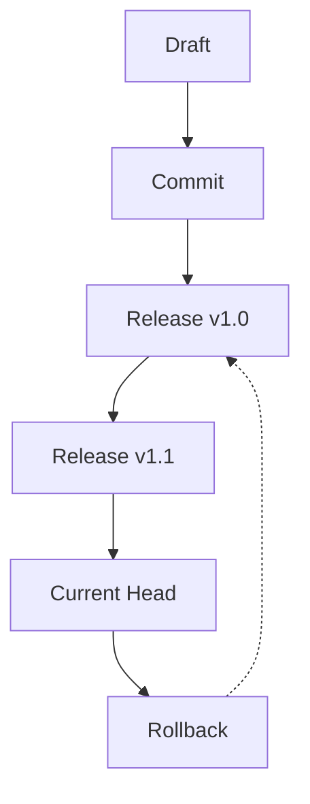

## Overview

You manage documentation effectively by grasping key concepts like spaces, projects, versioning, permissions, and integrations. These principles form the foundation of Mateusz Woźniak's documentation platform, enabling scalable organization and collaboration.

<Columns cols={2}>
  <Card title="Spaces" icon="layout" href="#spaces-vs-projects">
    Organize top-level containers for documentation.
  </Card>
  <Card title="Projects" icon="folder" href="#spaces-vs-projects">
    Group related docs within spaces.
  </Card>
  <Card title="Versioning" icon="git-branch" href="#versioning">
    Track changes with full history.
  </Card>
  <Card title="Permissions" icon="shield" href="#permissions">
    Control access granularly.
  </Card>
</Columns>

## Spaces vs Projects Structure

Spaces act as top-level containers, while projects nest inside them for focused documentation sets.

<Tabs>
  <Tab title="Spaces" icon="globe">
    Create a space for broad topics like "Product Docs" or "Developer Guides". Spaces support unlimited projects and provide global settings.

    ```javascript
    // API to create a space
    const response = await fetch('https://api.example.com/spaces', {
      method: 'POST',
      headers: { 'Authorization': 'Bearer YOUR_TOKEN' },
      body: JSON.stringify({
        name: 'Product Documentation',
        description: 'Official docs for Mateusz Woźniak platform'
      })
    });
    ```
  </Tab>
  <Tab title="Projects" icon="package">
    Projects organize files within spaces, ideal for versions or modules.

    ```javascript
    // API to create a project in a space
    const response = await fetch('https://api.example.com/spaces/{spaceId}/projects', {
      method: 'POST',
      headers: { 'Authorization': 'Bearer YOUR_TOKEN' },
      body: JSON.stringify({
        name: 'v2.0 Guides',
        visibility: 'private'
      })
    });
    ```
  </Tab>
</Tabs>

<Callout kind="info">
  Use spaces for cross-project themes and projects for granular control.
</Callout>

## Versioning and History Tracking

Versioning lets you maintain immutable snapshots of documentation. Track changes via Git-like commits.

<Steps>
  <Step title="Enable Versioning" icon="settings">
    Activate in project settings.

````bash
# Configure via CLI
mateusz-docs versioning enable --project-id proj_123
````

  </Step>
  <Step title="Create Release" icon="git-commit">
    Tag a version.

````javascript
await fetch('https://api.example.com/projects/{projectId}/releases', {
  method: 'POST',
  body: JSON.stringify({ tag: 'v1.2.0', notes: 'Added integrations' })
});
````

  </Step>
  <Step title="Rollback" icon="rotate-ccw">
    Restore previous version.

````bash
mateusz-docs rollback --project proj_123 --version v1.1.0
````

  </Step>
</Steps>



## Permissions and Access Controls

Define roles like Viewer, Editor, Admin at space and project levels.

<ParamField path="userId" param-type="string" required="true">
  Target user identifier.
</ParamField>

<ParamField path="role" param-type="string" required="true">
  Options: `viewer`, `editor`, `admin`.
</ParamField>

<Expandable title="Advanced Role Matrix" default-open="true">
  | Role   | Read | Write | Delete | Admin |
  |--------|------|-------|--------|-------|
  | Viewer | Yes  | No    | No     | No    |
  | Editor | Yes  | Yes   | No     | No    |
  | Admin  | Yes  | Yes   | Yes    | Yes   |
</Expandable>

<Callout kind="alert">
  Always apply least-privilege principle to prevent unauthorized edits.
</Callout>

## Integration with External Tools

Connect to GitHub, Slack, or CI/CD pipelines for seamless workflows.

<CodeGroup tabs="GitHub,Slack">
  ```javascript
  // GitHub webhook setup
  const webhook = {
    url: 'https://api.example.com/webhooks/github',
    events: ['push', 'pull_request']
  };
  ```
  ```javascript
  // Slack notification config
  const slack = {
    webhookUrl: 'https://hooks.slack.com/services/YOUR_WEBHOOK',
    channel: '#docs-updates'
  };
  ```
</CodeGroup>

<Expandable title="CI/CD Pipeline Example">
  Integrate with GitHub Actions for auto-publishing.

````yaml
name: Deploy Docs
on: [push]
jobs:
  deploy:
    runs-on: ubuntu-latest
    steps:
      - uses: actions/checkout@v4
      - run: mateusz-docs deploy --space prod --token ${{ secrets.DOCS_TOKEN }}
````

</Expandable>

Master these concepts to build robust documentation pipelines. Start by creating your first space and project today.