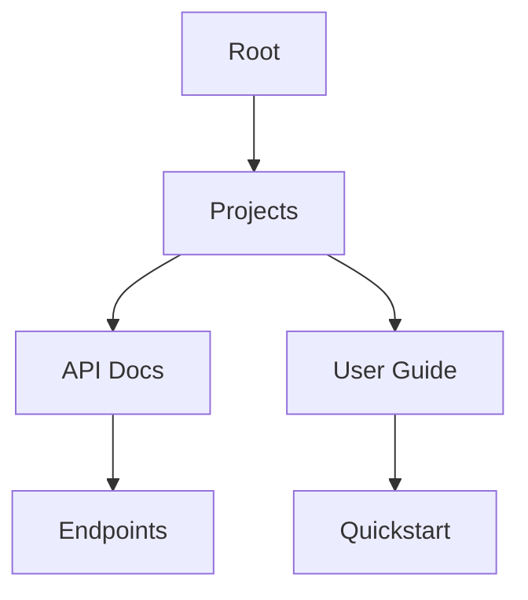

## Overview

Mateusz Woźniak's documentation platform empowers you to create, organize, and share project documentation efficiently. You gain access to intuitive tools for page management, hierarchical structuring, powerful search features, and seamless export options. These core features streamline collaboration and ensure your docs stay accessible and up-to-date.

<Callout kind="info">
  Start by creating your first page to experience these features hands-on.
</Callout>

## Key Features

Discover the platform's essential capabilities through these highlighted features.

<Columns cols={2}>
  <Card title="Page Tools" icon="edit-3" href="#page-creation">
    Create and edit rich MDX pages with live previews.
  </Card>
  <Card title="Project Folders" icon="folder" href="#project-structuring">
    Organize docs into nested folders for scalable projects.
  </Card>
  <Card title="Search & Filter" icon="search" href="#search-filtering">
    Quickly find content with advanced search and tags.
  </Card>
  <Card title="Export & Share" icon="share-2" href="#export-sharing">
    Generate PDFs, share links, or embed docs anywhere.
  </Card>
</Columns>

## Page Creation and Editing Tools

You create new pages directly from the dashboard or within folders. The editor supports full MDX syntax, including components like `<Callout>` and code blocks.

<Steps>
  <Step title="Create Page" icon="plus">
    Click the `+ New Page` button and select a template.
  </Step>
  <Step title="Edit Content" icon="edit">
    Use the split-view editor for real-time previews.
  </Step>
  <Step title="Add Components" icon="components">
    Insert JSX components via the toolbar.
  </Step>
  <Step title="Publish" icon="upload">
    Save and publish with one click.
  </Step>
</Steps>

For example, add a code snippet in your MDX page:

<CodeGroup tabs="JavaScript,Python">
  ```javascript
  // Sample API call
  const response = await fetch('https://api.example.com/docs', {
    headers: { Authorization: `Bearer ${YOUR_API_KEY}` }
  });
  ```
  ```python
  # Sample API call
  import requests
  response = requests.get('https://api.example.com/docs', headers={
      'Authorization': f'Bearer {YOUR_API_KEY}'
  })
  ```
</CodeGroup>

## Project Structuring and Folders

Organize large projects using nested folders. You create folders via drag-and-drop or the context menu.

| Feature | Description | Use Case |
|---------|-------------|----------|
| Nested Folders | Unlimited depth for hierarchies | Docs for multi-module apps |
| Drag & Drop | Reorder pages and folders easily | Quick refactoring |
| Permissions | Folder-level access control | Team collaboration |



<Expandable title="Advanced Folder Tips" default-open="false">
  Use tags alongside folders for cross-project filtering. Assign permissions at the folder level to control who edits what.
</Expandable>

## Search and Filtering Options

Powerful search helps you locate content instantly. Filter by tags, folders, or dates.

<Tabs>
  <Tab title="Basic Search" icon="search">
    Enter keywords in the top bar to find matching pages.
  </Tab>
  <Tab title="Advanced Filters" icon="filter">
    Combine tags like `feature` or `bugfix` with folder paths.
  </Tab>
  <Tab title="Saved Searches" icon="bookmark">
    Pin frequent queries for quick access.
  </Tab>
</Tabs>

<Callout kind="tip">
  Use quotes for exact phrases, e.g., `"project setup"`.
</Callout>

## Export and Sharing Functionalities

Share your docs effortlessly. Export to PDF, HTML, or generate public links.

<Steps>
  <Step title="Export PDF" icon="file-text">
    Select pages and choose PDF from the export menu.
  </Step>
  <Step title="Share Link" icon="link">
    Toggle public access and copy the shareable URL.
  </Step>
  <Step title="Embed" icon="code">
    Get embed code for your site: `<iframe src="https://docs.example.com/embed/project">`.
  </Step>
</Steps>

## Next Steps

<Card title="Quickstart" icon="zap" href="/quickstart">
  Set up your first project in under 5 minutes.
</Card>

<Card title="Authentication" icon="shield" href="/authentication">
  Secure your docs with API keys.
</Card>